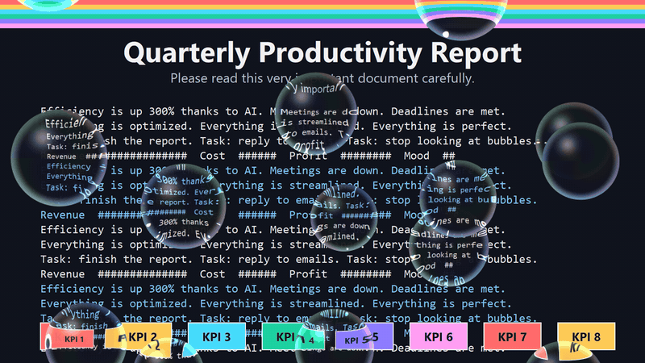

# Anti-Productivity Bubbles (APB)

> The anti-productivity bubble overlay. Because AI already makes you efficient enough.
> Author: DoraNeko (どら猫)

Windows desktop overlay that renders rising, refractive soap bubbles (15 per monitor by default) over every monitor.



- English manual: [README/README.en.md](README/README.en.md)
- 日本語説明書: [README/README.ja.md](README/README.ja.md)
- Specification: [Japanese](SPECIFICATION/SPECIFICATION.ja.md) / [English](SPECIFICATION/SPECIFICATION.en.md)

## Build

Requirements: Windows 10/11, Visual Studio 2022 (Desktop development with C++), Windows SDK 10.0.26100.0.

```powershell
MSBuild APB.vcxproj /t:Rebuild /p:Configuration=Release /p:Platform=x64
```

Output: `bin\x64\Release\` (`APB.exe`, `settings.ini`). Shaders are embedded in the exe and the C++ runtime is statically linked.

To create a release zip with a SHA-256 checksum: `powershell -ExecutionPolicy Bypass -File scripts\package.ps1` (output in `dist\`).

## Quick start

Run `APB.exe`. Press `Esc` to exit (`Esc` + Left Shift + Left Ctrl always exits). Edit `settings.ini` to customize; it reloads automatically. A tray icon provides pause, reload, autostart and exit.

## License

[MIT](LICENSE). See [CHANGELOG.md](CHANGELOG.md) for release notes.
